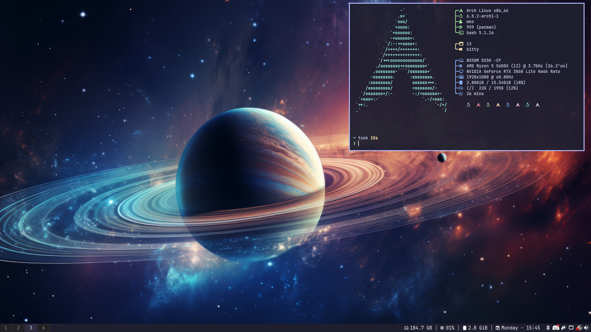

# This is the list of the supported configurations

## dwm-mko

My [Heavily Patched DWM Configuration](https://github.com/gitmko/dwm-mko) built with [dwm-flexipatch](https://github.com/bakkeby/dwm-flexipatch)

## i3-mko

My [Custom i3wm Configuration](https://github.com/gitmko/i3-mko) with [nvim-mko](https://github.com/gitmko/nvim-mko) and [tmux-mko](https://github.comnvim/gitmko/tmux-mko) (optional)

