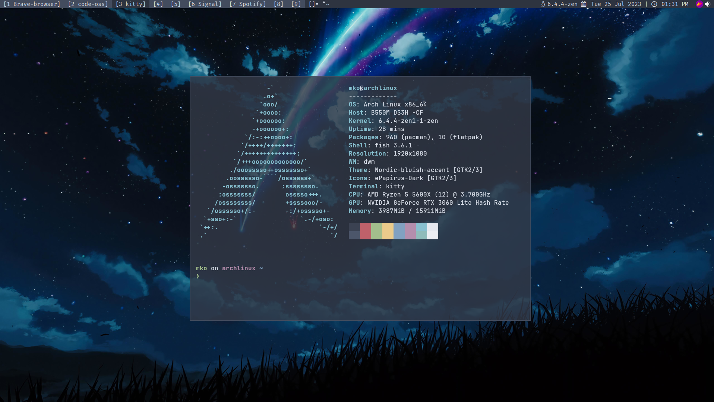
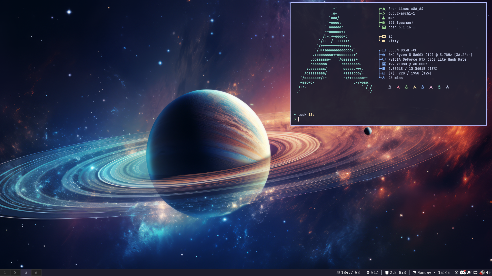
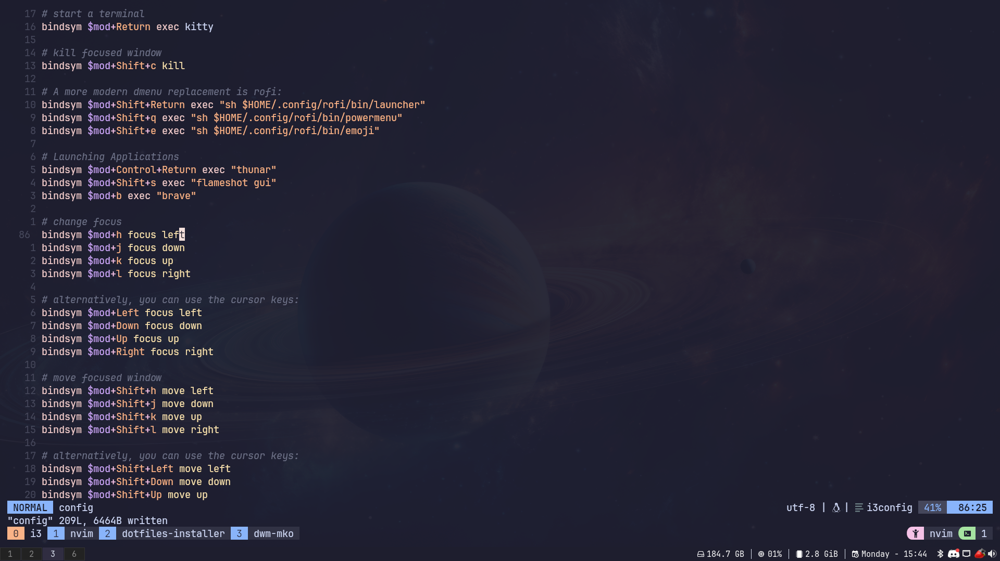

# dotfiles-installer

### A dotfiles installation tool, making installing someone's dotfiles seemless! 

## Here are some supported configurations..

## dwm-mko

My [Heavily Patched DWM Configuration](https://github.com/gitmko/dwm-mko) built with [dwm-flexipatch](https://github.com/bakkeby/dwm-flexipatch)



## i3-mko

My [Custom i3wm Configuration](https://github.com/gitmko/i3-mko) with [nvim-mko](https://github.com/gitmko/nvim-mko) and [tmux-mko](https://github.comnvim/gitmko/tmux-mko) (optional)




[And many more...](DOTFILES.md)

## Installation

### Dependencies

You need [gum](https://github.com/charmbracelet/gum) installed for the scripts to work.

On Arch systems, do
```bash
sudo pacman -S gum --noconfirm
```

On Fedora systems, do
```bash
echo '[charm]
name=Charm
baseurl=https://repo.charm.sh/yum/
enabled=1
gpgcheck=1
gpgkey=https://repo.charm.sh/yum/gpg.key' | sudo tee /etc/yum.repos.d/charm.repo
sudo yum install gum -y
```

On Debian systems, do
```bash
sudo mkdir -p /etc/apt/keyrings
curl -fsSL https://repo.charm.sh/apt/gpg.key | sudo gpg --dearmor -o /etc/apt/keyrings/charm.gpg
echo "deb [signed-by=/etc/apt/keyrings/charm.gpg] https://repo.charm.sh/apt/ * *" | sudo tee /etc/apt/sources.list.d/charm.list
sudo apt update && sudo apt install gum -y
```
Once you've installed gum, run the following commands

```
git clone https://github.com/gitmko/dotfiles-installer
cd dotfiles-installer/scripts
./install
```

## Adding your own dotfiles

Check the [support document](SUPPORT.md) for instructions on how to add your dotfiles on the list!
